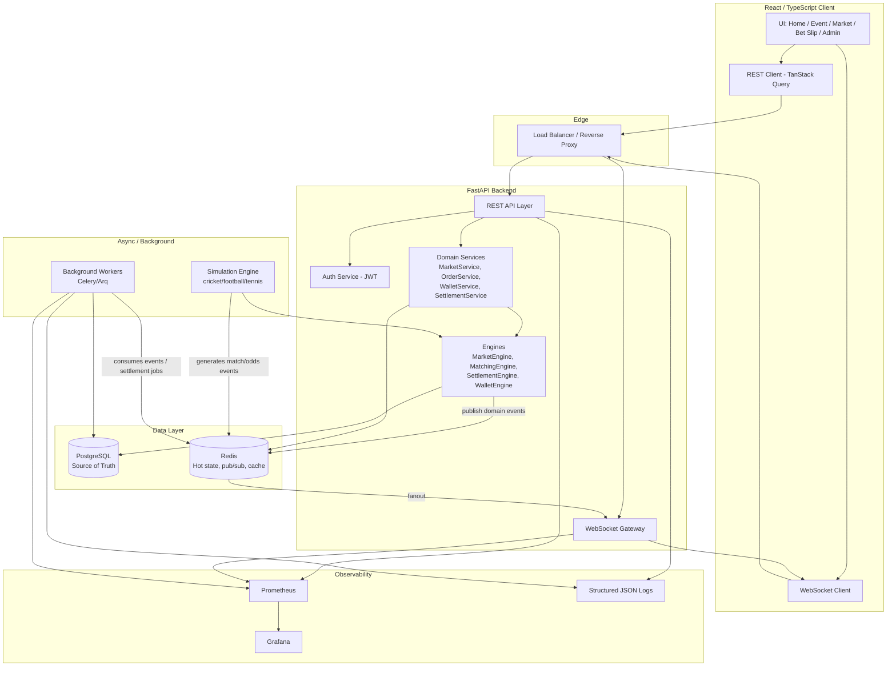
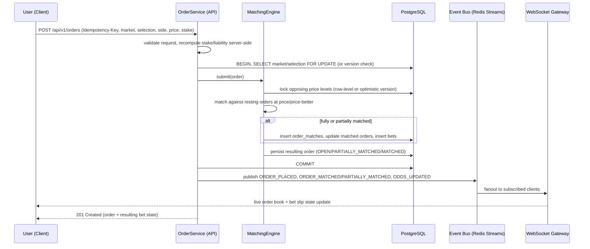
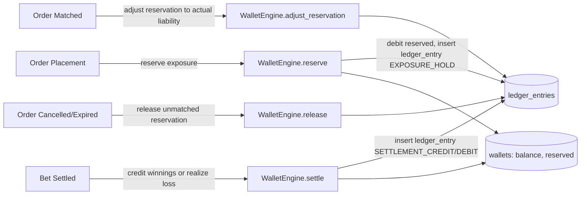
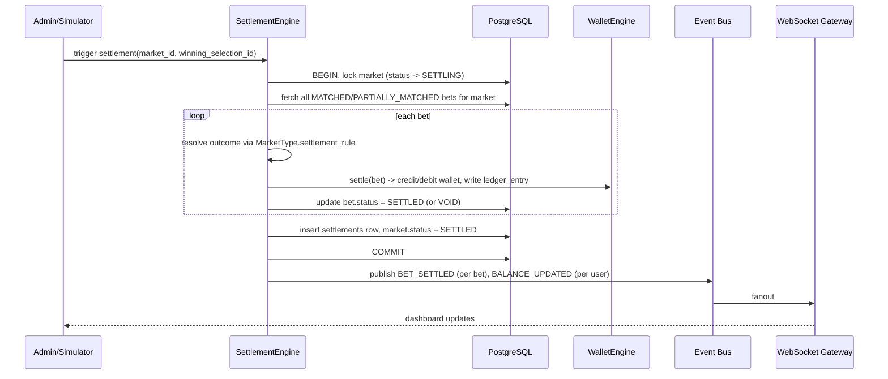

# Sports Exchange Simulator — Architecture (Step 1 Deliverable)

> Paper-trading sports exchange. All balances are simulated. No real-money deposits,
> withdrawals, or wagering are implemented anywhere in this system.

This document is the required "First Response" artifact before implementation begins
(see `Prompt.txt`, Section 44). It covers sections A–M. No application code is written
yet — implementation starts only after "START STEP 1" is given.

---

## A. System Architecture Diagram



**Key principle:** PostgreSQL is the single source of financial truth. Redis is
transient — hot market state, pub/sub fanout, caching, rate limiting. Nothing
financially authoritative lives only in Redis.

---

## B. Frontend Architecture

**Stack:** React 18, TypeScript, Vite, React Router, TanStack Query (server state),
Zustand (client/UI state), native WebSocket client with reconnect logic, React Hook
Form + Zod (validation).

**Layering:**

```text
pages/            route-level composition, no business logic
layouts/           AppShell, AuthLayout, AdminLayout
features/<domain>  self-contained: components, hooks, api, store slice, types
  auth/
  sports/
  events/
  markets/
  betslip/
  bets/
  wallet/
  profile/
  admin/
design-system/     tokens + primitives (Button, Input, OddsCell, Card, ...)
services/          low-level API + WebSocket clients (framework-agnostic)
hooks/             cross-feature hooks (useWebSocketSubscription, useDebounce)
store/             root Zustand store composition
types/             shared TS types generated/mirrored from backend schemas
utils/             pure helper functions (odds math, formatting)
```

**State split (Section 29):**
- Server state (events, markets, odds snapshots, bets, wallet) → TanStack Query,
  hydrated initially via REST, kept live via WebSocket-driven cache updates
  (`queryClient.setQueryData`), not polling.
- Client/UI state (selected odds, bet slip draft, sidebar/modal, filters) → Zustand,
  scoped per feature, not one global store.

**Real-time integration pattern:** a single `WebSocketManager` service maintains one
socket per scope (`/ws/user`, `/ws/event/{id}`, `/ws/market/{id}`), dedupes by
event id + sequence number, and dispatches typed events into TanStack Query cache
updates. Components never touch the socket directly.

**Rendering performance (Section 30):** `OddsCell` is memoized and keyed by
`(selectionId, side, price, availableSize)`; market lists use virtualization once
market count is large; routes are code-split per feature.

---

## C. Backend Architecture

**Stack:** Python, FastAPI, SQLAlchemy (async) + Alembic, Pydantic v2 schemas,
PostgreSQL, Redis, WebSockets, a task queue (Arq, Redis-backed) for background work.

**Layering (Section 17):**

```text
api/          HTTP route handlers — thin, delegate to services, no business logic
websocket/    WS route handlers, connection registry, auth handshake
core/         cross-cutting: settings, logging, error types, middleware
config/       environment/config loading (pydantic-settings)
domain/       pure domain objects, value objects, state machines (no I/O)
models/       SQLAlchemy ORM models
repositories/ persistence access (query methods), one per aggregate
services/     use-case orchestration: BetService, WalletService, MarketService,
              SettlementService — transaction boundaries live here
engines/
  market_engine/      market/selection/price state transitions
  matching_engine/    order book, BACK/LAY matching, partial fills
  settlement_engine/  market settlement -> bet settlement -> ledger postings
  wallet_engine/      balance, exposure, reservation math
  simulation_engine/  synthetic match/odds generator
events/       domain event definitions + publisher (Redis Streams)
schemas/      Pydantic request/response DTOs
security/     JWT, password hashing, RBAC dependencies
observability/ structured logging, request/correlation IDs, metrics
workers/      background job entrypoints (settlement sweep, simulator tick, etc.)
```

**Rule enforced throughout:** route handlers only parse/validate input, call one
service method, and map the result/exception to an HTTP response. All business logic,
transaction boundaries, and locking live in `services/` and `engines/`.

---

## D. Database ER Diagram

```mermaid
erDiagram
    USERS ||--o{ WALLETS : has
    USERS ||--o{ ORDERS : places
    USERS ||--o{ BETS : owns
    USERS }o--o{ ROLES : "has (user_roles)"
    ROLES }o--o{ PERMISSIONS : "has (role_permissions)"

    SPORTS ||--o{ COMPETITIONS : contains
    COMPETITIONS ||--o{ EVENTS : contains
    EVENTS ||--o{ MARKETS : contains
    MARKET_TYPES ||--o{ MARKETS : classifies
    MARKETS ||--o{ SELECTIONS : contains
    SELECTIONS ||--o{ ORDERS : "priced against"

    ORDERS ||--o{ ORDER_MATCHES : "matched via"
    ORDER_MATCHES ||--|| BETS : "produces"
    MARKETS ||--o{ SETTLEMENTS : "settled by"
    SETTLEMENTS ||--o{ BETS : settles

    WALLETS ||--o{ LEDGER_ENTRIES : records
    BETS ||--o{ LEDGER_ENTRIES : "generates"
    ORDERS ||--o{ LEDGER_ENTRIES : "reserves exposure via"

    EVENTS ||--o{ SIMULATOR_EVENTS : "drives state via"
    USERS ||--o{ AUDIT_LOGS : "acted by"
    USERS ||--o{ NOTIFICATIONS : receives

    USERS {
        uuid id PK
        string email
        string password_hash
        string status
        timestamptz created_at
        timestamptz updated_at
    }
    WALLETS {
        uuid id PK
        uuid user_id FK
        bigint balance_minor
        bigint reserved_minor
        int version
        timestamptz updated_at
    }
    LEDGER_ENTRIES {
        uuid id PK
        uuid wallet_id FK
        uuid ref_order_id FK
        uuid ref_bet_id FK
        string entry_type
        bigint amount_minor
        bigint balance_after_minor
        string idempotency_key
        timestamptz created_at
    }
    SPORTS { uuid id PK, string code, string name }
    COMPETITIONS { uuid id PK, uuid sport_id FK, string name }
    EVENTS { uuid id PK, uuid competition_id FK, string name, string status, timestamptz start_time }
    MARKET_TYPES { uuid id PK, string code, string name, jsonb settlement_rule }
    MARKETS { uuid id PK, uuid event_id FK, uuid market_type_id FK, string name, string status, int version }
    SELECTIONS { uuid id PK, uuid market_id FK, string name, int display_order }
    ORDERS {
        uuid id PK
        uuid user_id FK
        uuid market_id FK
        uuid selection_id FK
        string side
        numeric price
        bigint stake_minor
        bigint matched_minor
        string status
        string idempotency_key
        int version
        timestamptz created_at
    }
    ORDER_MATCHES {
        uuid id PK
        uuid taker_order_id FK
        uuid maker_order_id FK
        numeric matched_price
        bigint matched_size_minor
        timestamptz created_at
    }
    BETS {
        uuid id PK
        uuid user_id FK
        uuid order_id FK
        uuid market_id FK
        uuid selection_id FK
        string side
        numeric price
        bigint stake_minor
        bigint liability_minor
        string status
        timestamptz created_at
    }
    SETTLEMENTS {
        uuid id PK
        uuid market_id FK
        uuid winning_selection_id FK
        string status
        timestamptz settled_at
    }
    AUDIT_LOGS { uuid id PK, uuid user_id FK, string action, jsonb payload, timestamptz created_at }
    NOTIFICATIONS { uuid id PK, uuid user_id FK, string type, jsonb payload, bool read, timestamptz created_at }
    PROMOTIONS { uuid id PK, string title, string body, bool active }
    SIMULATOR_EVENTS { uuid id PK, uuid event_id FK, string type, jsonb payload, timestamptz created_at }
```

Notes:
- Money stored as `bigint` minor units (paise), never floats.
- `orders.version` / `markets.version` support optimistic locking (Section 22).
- `ledger_entries.idempotency_key` is unique — enforces Section 21 at the DB level.

---

## E. Domain Model

```text
Sport → Competition → Event → Market → Selection → Price(level)
```

- **Sport**: top-level category (Cricket, Football, Tennis). Not hard-coded in the
  frontend — the sports menu is data-driven from `GET /api/v1/sports`.
- **Competition**: grouping within a sport (e.g. "Test Matches").
- **Event**: a specific match (e.g. "England vs Pakistan"), owns lifecycle status
  (`SCHEDULED`, `LIVE`, `SUSPENDED`, `COMPLETED`).
- **Market**: a bettable question on an event, typed via `MarketType`
  (`MATCH_ODDS`, `BOOKMAKER`, `FANCY`, `PLAYER_RUNS`, `OVER_UNDER`, `WICKETS`, ...).
  Each `MarketType` carries a `settlement_rule` describing how to resolve it
  generically, so new market types don't require new settlement code paths for the
  common cases (winner-takes, over/under threshold).
- **Selection**: an outcome within a market (e.g. "England", "Over 165.5").
- **Price**: not a stored row per se — it is the current best-of-book view derived
  from live `orders` for a `(market, selection, side)`, held in Redis for fast reads
  and reconstructable from PostgreSQL as the source of truth.

This hierarchy is fully data-driven: adding a new sport or market type is a data
operation (seed/admin action), not a code change.

---

## F. Order Matching Flow



State machine (Section 14), enforced only in `MatchingEngine`/`BetService`:

```text
CREATED → PENDING → ACCEPTED → OPEN → PARTIALLY_MATCHED → MATCHED
                                  ↓             ↓
                              CANCELLED     SETTLED / VOID
ACCEPTED → REJECTED (validation/suspended market)
```

---

## G. Wallet / Ledger Flow



Every balance mutation is: `BEGIN → SELECT wallet FOR UPDATE → compute new balance →
INSERT ledger_entry (immutable, append-only) → UPDATE wallet.balance/reserved →
COMMIT`. The wallet's `balance`/`reserved` columns are a materialized, always-derivable
cache of the ledger — the ledger is the true record. `available_to_bet = balance -
reserved`, shown to the user as Balance / Exposure / Available (Section 15).

---

## H. Settlement Flow



Settlement is idempotent: a `settlements` row keyed by `market_id` plus a
per-bet `status` guard means re-running settlement for an already-settled market is a
no-op, not a double-payout.

---

## I. WebSocket Architecture

```text
Market/Settlement/Wallet Engines
        ↓ publish domain event
   Redis Streams (per-topic: event:{id}, market:{id}, user:{id})
        ↓ consumed by
   WebSocket Gateway (stateless, horizontally scalable)
        ↓ fanout to subscribed connections
   React Client (WebSocketManager)
```

- Channels: `/ws/events/{event_id}`, `/ws/markets/{market_id}`, `/ws/user`
  (auth-scoped: balance, own bet/order updates).
- Client subscribes/unsubscribes dynamically as the user navigates.
- Every event carries a monotonically increasing `sequence` per topic; the client
  drops duplicates and detects gaps (Section 19) — a detected gap triggers a REST
  resync (`GET .../order-book`) rather than trusting a possibly-stale stream.
- Reconnect uses exponential backoff with jitter; on reconnect the client resyncs via
  REST before resuming live updates, so a dropped connection never leaves stale prices
  displayed as live.
- Heartbeat ping/pong detects dead connections server-side and frees resources.
- The gateway is stateless w.r.t. domain state — it only holds subscription
  registries — so it scales horizontally behind the load balancer.

---

## J. Complete Repository Structure

```text
sports-exchange/
├── frontend/
│   └── src/
│       ├── app/            # router, providers, entry
│       ├── components/     # shared, non-design-system composites
│       ├── features/
│       │   ├── auth/ sports/ events/ markets/ betslip/
│       │   ├── bets/ wallet/ profile/ admin/
│       ├── hooks/
│       ├── services/       # api client, ws client
│       ├── store/
│       ├── types/
│       ├── utils/
│       ├── pages/
│       ├── layouts/
│       └── design-system/
│
├── backend/
│   └── app/
│       ├── api/ core/ config/ domain/ models/ repositories/ services/
│       ├── engines/
│       │   ├── market_engine/ matching_engine/ settlement_engine/
│       │   ├── wallet_engine/ simulation_engine/
│       ├── websocket/ workers/ events/ schemas/ security/ observability/
│       └── tests/
│
├── worker/                 # background job entrypoints (settlement sweep, cleanup)
├── simulator/               # standalone simulator process (can also run in-process)
├── infrastructure/          # IaC (Terraform) for eventual AWS deployment
├── docker/                  # per-service Dockerfiles
├── tests/                   # cross-service / e2e (Playwright)
├── docs/
│   ├── architecture.md      # this document
│   ├── domain-model.md
│   ├── websocket.md
│   ├── matching-engine.md
│   ├── wallet-ledger.md
│   ├── settlement.md
│   ├── security.md
│   ├── observability.md
│   ├── deployment.md
│   └── api.md
├── docker-compose.yml
├── .env.example
├── README.md
└── Makefile
```

---

## K. Technology Justification

| Choice | Why |
|---|---|
| FastAPI | async-native, Pydantic validation, auto OpenAPI docs, good WebSocket support |
| PostgreSQL | ACID guarantees for financial ledger data; row locking/`FOR UPDATE`; mature |
| Redis | sub-millisecond hot-state reads, native pub/sub + Streams for event fanout, doubles as rate-limit store |
| SQLAlchemy (async) + Alembic | explicit migrations, mature ORM, works cleanly with `FOR UPDATE`/versioning |
| React + TypeScript + Vite | fast dev loop, strong typing across a data-driven domain model |
| TanStack Query | purpose-built for server-state caching + WebSocket-driven cache patching, avoids manual polling |
| Zustand | minimal boilerplate for UI-only state; keeps server state out of a global reducer |
| Redis Streams (not raw pub/sub) | consumer groups + replay give at-least-once delivery, needed since financial events must not be silently dropped |
| Arq (Redis-backed task queue) | lightweight async worker matching the async FastAPI stack, avoids introducing a second broker (e.g. RabbitMQ) at this scale |
| Docker Compose (local) → ECS/K8s-compatible (prod) | one-command local dev now, without foreclosing container-orchestrated AWS deployment later |

---

## L. Development Roadmap

Maps directly to `Prompt.txt` Section 40:

1. **Step 1 (this document):** architecture, domain model, schema, API/WS spec — awaiting approval.
2. **Step 2:** backend foundation — FastAPI app, config, PostgreSQL, Alembic, auth, base models/repos/services, initial tests.
3. **Step 3:** market engine — sports/competitions/events/markets/selections/odds/liquidity, all data-driven.
4. **Step 4:** matching engine — BACK/LAY order book, partial matching, cancellation, suspension.
5. **Step 5:** wallet/ledger — reservation, exposure, settlement postings, transaction history.
6. **Step 6:** WebSocket layer — live odds/order/wallet updates, reconnect/resync.
7. **Step 7:** React UI — layout, navigation, home, event page, markets, odds grid, bet slip, my bets, wallet.
8. **Step 8:** admin panel.
9. **Step 9:** simulator (cricket first, then football/tennis).
10. **Step 10:** full test suite (backend pytest, frontend Vitest/RTL/Playwright, concurrency tests).
11. **Step 11:** observability (structured logs, Prometheus metrics, Grafana dashboards).
12. **Step 12:** Docker Compose + production deployment docs (AWS-shaped, IaC).

Each step, per Section 41, opens with problem/domain/data-model/API/state-machine/
failure-scenario/concurrency/testing notes before any code is written.

---

## M. Major Risks and Concurrency Problems

1. **Double-spend on shared liquidity (Section 22).** Two users consuming the same
   resting order simultaneously. Mitigation: matching happens inside a single DB
   transaction with `SELECT ... FOR UPDATE` on the resting order (or optimistic
   `version` check with retry-on-conflict), so total matched size can never exceed
   available size. Covered by dedicated concurrency tests (concurrent client requests
   against one price level).

2. **Non-idempotent retries (Section 21).** A client retry (network blip) on
   place-order/cancel-order/settle/wallet-mutate must not double-execute. Mitigation:
   `Idempotency-Key` header, unique constraint on `(user_id, idempotency_key)` per
   operation table, first-writer-wins with cached response replay for duplicates.

3. **Stale odds acted upon.** Client displays a price that has since moved or been
   suspended. Mitigation: backend re-validates market status and current price/
   liquidity at order-submission time — never trusts the price sent by the client
   as authoritative for matching, only as the limit price.

4. **WebSocket message loss/out-of-order delivery.** Mitigation: per-topic sequence
   numbers, gap detection triggers REST resync; Redis Streams consumer groups give
   at-least-once delivery to the WS gateway.

5. **Settlement run twice / partially failed mid-run.** Mitigation: settlement is
   transactional per market with a `settlements` row as a completion marker, and
   idempotent bet-status guards so a retried or resumed settlement run cannot
   double-pay a bet.

6. **Wallet balance drift from ledger.** Mitigation: `wallets.balance`/`reserved`
   are treated as a cache of the ledger; a periodic reconciliation job recomputes
   balance from `ledger_entries` and alerts on mismatch rather than silently trusting
   the cached column forever.

7. **Floating-point money errors.** Mitigation: all monetary and stake values stored
   and computed as integer minor units (paise), never `float`/`double`, in both
   backend and frontend calculation code.

8. **Market with hundreds of markets/selections causing UI jank (Section 30).**
   Mitigation: virtualized lists, memoized `OddsCell`, targeted WebSocket cache
   patches (not full re-fetch) per update.

9. **Suspended-market race.** An order in flight when a market suspends. Mitigation:
   market status is checked and locked as part of the same transaction as order
   matching, so a suspend that lands mid-match either wins (order rejected) or loses
   (already committed) atomically — never a half-applied state.

---

## Next Step

This satisfies Section 44 (A–M). No implementation code has been written. Reply
**"START STEP 1"** to begin Step 2 of the roadmap (backend foundation), or request
changes to any section above first.
